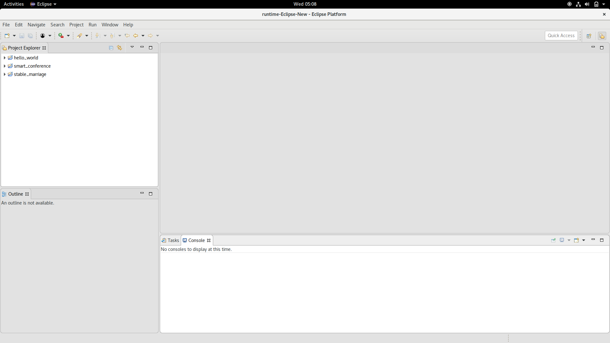
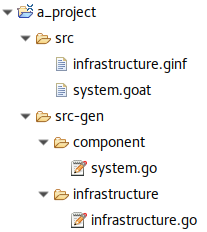

# Programming with the GoAt Eclipse plugin
We developed the Eclipse plugin to give the user the power to describe CAS interaction schemes in a language agnostic way. Another point we stress is that even the interaction scheme is independent from the message exchange infrastructure.

When launching the plugin, you get this screen



On the left, you have the set of projects that are in your workspace. In GoAt, a project is a description of your system in term of components, interaction and infrastructure. You can create a new project by right-clicking on the Project Explorer, New > Project... . Among the wizards, choose Goat > Goat project, then click Next and give it a name (e.g. "a\_project").

Now, in the Project Explorer, expand the project tree.



The `src` directory contains two types of files: `.ginf` and `.goat`. `.ginf` files describe the communication infrastructure between the component (that is, how the messages are delivered), while `.goat` files describe the components of the system and how they interact. We require the infrastructure details to be kept away from the components because:
* we want to stress that the component behaviour is independent from how the messages are delivered;
* they might be developed by different users: the system administrator configures the infrastructure, and the programmer develops the components.

The only linking point is the `infrastructure` statement in `.goat` files which states that the components described inside use a specific named infrastructure.

The `src-gen` directory contains the go code generated from the code generation procedure that corresponds to the infrastructure(s) and component(s) described in the project. When a system is run, the plugin calls Go and runs the files inside this directory. Note that component and infrastructure files are kept separated.

## Running a project
This section describes how to run a GoAt project. To do this, we provide a simple system just to see some interaction. Next sections describe the specification language.

Open `infrastructure.ginf` and paste this code, then save the file (CTRL+S):
```
singleserver infr {
  server : "127.0.0.1:17654"
}
```
Open `system.goat` and paste this code, then save the file:
```
infrastructure infr

process P {
  send{"hello world"} @ (true);
}

process Q {
  receive(true){x} print("Got $x$");
}

component {} : P
component {} : Q
```
This code describes:
* a centralised infrastructure whose address is `127.0.0.1:17654`;
* a system made of two component, where one sends `hello world` to the other, using the infrastructure.

The plugin offers an editor with syntax higlighting and error checking. Try, for example, to change `send` to `sed` and you will get an error.

Right-click on the project, then click Run As > Run System. Now you get two consoles in the Console view, and you can switch between them with this drop-down menu . The consoles contain the standard output (in black) and standard error (in red) of the system and of the infrastructure. Open the `system.goat` console. It contains `Got hello world`. The component whose process is P has sent the `hello world` message to every component (`true` predicate). The component whose process is Q received the message and printed it out with the `print` directive. Since both the components terminated, also the system terminated. Now open the `infrastructure.ginf` console. The only output line is `Started`, to singal that the infrastructure started. The infrastructure is still running, waiting for new messages. You can stop it by pressing the Terminate button (). Before closing the plugin or running other systems, remember to stop all running infrastructure and components as they might interefere with the new runs.

## Programming components
This section describes how to program the components in `.goat` files. Components are the parts of the system that interact in order to attain a global behaviour. The first part describes the main constructs that can be used; the remainder describes some  patterns that recur during the development.

### GoAt constructs
A `.goat` file begins with `infrastructure infr` where `infr` is the name of an infrastructure declared in the project. This statement says that the components described in this file are to be attached to the infrastructure `infr`.

The remainder of the file is a set of process, environment, component and function declarations.
* The processes represent the dynamic behaviour of components. They can send and/or receive mesages, access the component environment and use local attributes. Local attributes are not shared between processes, even if they are on the same component. 
* The environment is a map between names (called component attributes) and values. The environment represent the state of a component. The environment is not shared between components, but all processes running on a component can read and write over it.
* The component is the pair of an environment and a process. Components interact between each other by message passing according to their state.
* Functions are used to compute values, that can be sent with messages, saved in attributes or used in predicates.

### Process
A process is defined as 
```
process P {
  ...statement 1...
  ...statement 2...
  
  ...statement n...
}
```
`P` is the name of the process. The statements are executed one after another, and when the last statement terminates the process terminates. The available statements are: `send`, `receive`, `waitfor`, `set`, `if`, `call`, `spawn` and `loop`.
It is also possible to define a process as the parallel composition of a set of processes, using:

```process P = P1 | P2 | ... | Pn`

#### `send`
The `send` statement is used to send a message. Its syntax is 

```send{expr1, expr2, ..., exprn} @ (pred) [attr1 := expr_a1, attr2 := expr_a2, ..., attrm := expr_am] print("output");```

This statement sends the message (the tuple `{expr1, expr2, ..., exprn}`) to any component satisfying the predicate `pred`. Any message received while a process is sending is discarded, i.e. subsequent `receive`s from the same process will not perceive those messages. In the expressions `expr_i` it is possible to use component attributes and local attributes. They can be accessed by prepending `comp.` or `proc.` to the name of the attribute. Each component but the sender, evaluates the `pred` predicate (i.e. a boolean expression): the message is accepted if and only if `pred` evaluates to true. `pred` can refer to receiver attributes by prepending `receiver.` to its name.

> **Note 1:** Make sure that the component or local attributes you are referring exist. Otherwise, the component will crash at runtime.

> **Note 2:** `pred` may refer to receiver attributes that do not exist on other component. In that case, the attribute is considered to be neither equal, greater, littler, different than anything and neither true or false. 
>
> For example, assuming that the receiver does not have the attribute x, the predicate `receiver.x == v || receiver.x != v` is always false no matter which is the value of v. Otherwise, if attribute x is defined and has the same type of v, the predicate is always true.

The `[attr1 := expr_a1, attr2 := expr_a2, ..., attrm := expr_am]` part updates the component or local attributes to the evaluation of the corresponding expressions. This part can be omitted if the attributes do not change.

`print("output")` prints on the standard output the specified string after sending the message. Inside the string, it is possible to get the value of a local attribute (e.g. `x`) by writing its name between dollar signs (e.g. `$x$`). It is possible to get the value of a component attribute (e.g. `a`) by writing its name prefixed with `comp.` between dollar signs (e.g. `$comp.a$`). Even this part is optional, and if omitted after the send nothing will be printed out.

> **Note 3:** The print part is to be used only for debugging purpouses. The printing format might change in the future.

#### `receive`
The `receive` statement is used to receive a message. It has two possible syntaxes.

The first syntax is:

```
receive (pred) {lattr1, lattr2, ..., lattrn} [attr1 := expr1, attr2 := expr2, ..., attrm := exprm] print ("output");
```

This statement accepts the first message that satisfies the `pred` predicate and has exactly n parts. Then, the part i is assigned to the local attribute `attri`. If the received message does not can not be accepted, it is discarded and the process waits for another message.

The `[attr1 := expr1, attr2 := expr2, ..., attrm := exprm]` part updates the component or local attributes to the evaluation of the corresponding expressions. It is possible to access component attributes by prepending `comp.` to the name of the attribute. It is possible to access local attributes by prepending `proc.` to the name of the attribute. This part can be omitted if the attributes do not change.
> **Note:** Make sure that the component or local attributes you are referring in `expr`s exist. Otherwise, the component will crash at runtime.

> **Tip:** You can set component attributes to received values by using the update part: first save the message part in a fresh local attribute, then copy it in the component attribute. For example, `receive(true){x}[comp.x := proc.x];` saves in the component attribute x the content of the first message received that has only one part.

`print("output")` prints on the standard output the specified string after receiving a suitable message. Inside the string, it is possible to get the value of a local attribute (e.g. `x`) by writing its name between dollar signs (e.g. `$x$`). It is possible to get the value of a component attribute (e.g. `a`) by writing its name prefixed with `comp.` between dollar signs (e.g. `$comp.a$`). Even this part is optional, and if omitted after the reception nothing will be printed out.

The other syntax is:
```
receive {
    case (pred1) {lattr1_1, lattr1_2, ..., lattr1_n1} [attr1_1 := expr1_1, attr1_2 := expr1_2, ..., attr1_m := expr1_m1] print ("output1"): {
        ... statements1 ...
    }
    
    case (pred2) {lattr2_1, lattr2_2, ..., lattr2_n2} [attr2_1 := expr2_1, attr2_2 := expr2_2, ..., attr2_l := expr2_m2] print ("output2"): {
        ... statements2 ...
    }
    
    ...
} 
```

This statement accepts the first message that satisfies `predj` where `predj` is a predicate stated in one of the cases. If more than one is satisfied, then we consider the one with the lowest `j`. It is similar to a `switch ... case` statement used in many imperative languages. Then, it saves the message parts, updates the environment and prints a message as explained for the first syntax of `receive`. After, the statements `statementsj` are executed. If the received message does not satisfy any of the predicates, it is discarded and the process waits for another message.

#### `waitfor`
The `waitfor` statement waits until a condition is satisfied or a period of time is elapsed. Any message received while waiting is discarded. 

Its syntax is:

```
waitfor(cond)[attr1 := expr1, attr2 := expr2, ..., attrm := exprm] print ("output");
```

`cond` can be:
* a predicate over local and component attributes, accessed prepending `proc.` or `comp.` to the name of the attribute
* an integer constant stating the number of milliseconds to wait

The `[attr1 := expr1, attr2 := expr2, ..., attrm := exprm]` part updates the component or local attributes to the evaluation of the corresponding expressions. It is possible to access component attributes by prepending `comp.` to the name of the attribute. It is possible to access local attributes by prepending `proc.` to the name of the attribute. This part can be omitted if the attributes do not change.
> **Note:** Make sure that the component or local attributes you are referring in `expr`s exist. Otherwise, the component will crash at runtime.

`print("output")` prints on the standard output the specified string after waiting. Inside the string, it is possible to get the value of a local attribute (e.g. `x`) by writing its name between dollar signs (e.g. `$x$`). It is possible to get the value of a component attribute (e.g. `a`) by writing its name prefixed with `comp.` between dollar signs (e.g. `$comp.a$`). Even this part is optional, and if omitted nothing will be printed out.

#### `set`
The `set` statement updates the set of local and global attributes. 

Its syntax is:

```
set [attr1 := expr1, attr2 := expr2, ..., attrm := exprm] print ("output");
```

The `[attr1 := expr1, attr2 := expr2, ..., attrm := exprm]` part updates the component or local attributes to the evaluation of the corresponding expressions. It is possible to access component attributes by prepending `comp.` to the name of the attribute. It is possible to access local attributes by prepending `proc.` to the name of the attribute. This part can be omitted if the attributes do not change.
> **Note:** Make sure that the component or local attributes you are referring in `expr`s exist. Otherwise, the component will crash at runtime.

`print("output")` prints on the standard output the specified string after the update. Inside the string, it is possible to get the value of a local attribute (e.g. `x`) by writing its name between dollar signs (e.g. `$x$`). It is possible to get the value of a component attribute (e.g. `a`) by writing its name prefixed with `comp.` between dollar signs (e.g. `$comp.a$`). Even this part is optional, and if omitted nothing will be printed out.

#### `loop`
The `loop` statement repeats endlessly a sequence of statements. Its syntax is:

```
loop {
    ... statements to repeat ...
}
```

#### `if`
The `if` statement executes different codes according to the state of the attributes. Its syntax is:

```
if (cond1) {
  send/receive/set
  ...statements1...
} else if (cond2) {
  send/receive/set
  ...statements2...
} 
....
else {
  send/receive/set
  ...statements_e...
}
```

It is similar to the `if ... else if ... else` construct in imperative languages. It considers the first branch whose condition is satisfied; then it tries to execure the first statement. Depending on first statement of the block:
* if it is a `send`, it sends the message and then executes the rest of the block;
* if it is a `receive` and the first message received is accepted, it executes the rest of the block;
* if it is a `receive` and the first message received is not accepted, it waits for a change in the environment or a new message and retries the *whole* if statement;
* if it is a `set`, it updates the environment and then executes the rest of the block.

If none of the condition are satisfied, it executes the `else` block if available, otherwise it waits for a change in the environment or a new message and retries the whole if statement.

> **Tip:** in a block, if you do not want to change the environment nor send or receive messages, you can use `set;` as the first statement. Note that the `set` statement discards messages during its execution.

> **Note:** Unlike (many) imperative languages where an `if` without an `else` whose condition is not satisfied behaves as having an empty else branch, in GoAt blocks the execution of the process. The classical behaviour is re-establish by using `else{ set; }`. Pay attention that the `set` statement discards messages during its execution.

#### `call`
The `call` statement executes the code of another process. Its syntax is:

```
call(P)
```

`P` is the name of a process. `P` will inherit the set of local attributes of the current process. The control will not return to the current process, so any statements written after `call` will not be executed.

#### `spawn`
The `spawn` statement ceates a new process that executes the code of some process. Its syntax is:

```
spawn(P)
```

`P` is the name of a process. `P` will inherit a copy of the set of local attributes of the current process. The current process and the process just created will run concurrently on the same component. As any other pair of process, they share component attributes but not the set of local attributes.

### Environment
The environment is defined as:
`environment E {
  attr := immediate,
  attr := immediate,
  ....
  attr := immediate
}`

### Component
The component is defined as:

`component E : P`

`E` is an environment; it is a name of a defined environment or it can be replaced by the set of attributes and values. `P` is the name of a process or the parallel composition of a set of processes or a process definition.

### Functions and expressions
In attribute updates, predicates and message parts, it is possible to use values that depend on attributes. To describe them it is possible to use an expression language. The expressions are typed, and three types are defined: integers (`int`), booleans (`bool`) and strings (`string`). The operation defined are: 

| Operators | Applicable types | Return type |
|---|---|---|
| `<`, `<=`, `>`, `>=` | `int`, `string` | `bool` |
| `==`, `!=` | `int`, `string`, `bool` | `bool` |
| `&&` , `\|\|` | `bool` | `bool` |
| `+`, `-`, `*`, `/`, `%` | `int` | `int` |
| `++` (concatenation) | `string` | `string` |

There is also the unary operator `!` that negates a `bool`.

It is also possible to define functions, to be used in expressions. The function syntax is:

```
function type name (type param1, type param2, ...) {
  ... function statements ...
}
```
The avaliable statements are:
* variable declaration: `var name = expr` where the variable's type is inferred from `expr`;
* assignment to variables: `name = expr`;
* return: `return expr`;
* condition: `if ... else if ... else` whose behavior is the standard one.

Inside function is possible to use expressions that refer to parameters or variables. It is also possible to use function calls (even recursive ones).

## Patterns
TODO

## Defining infrastructures
This section describes how to define infrastructure in `.ginf` files. Infrastructures are what make the components actually communicate. Their role is to distribute messages from a component to all the others. There are four types of infrastructures: centralized, cluster, ring and tree. The syntax of a `.ginf` file is:

```
infrastructure_type name {
  param : value,
  param : value,
  ...
  param : value
}
```
The following table contains the list of parameters.

<table>
  <tr>
    <th>Infrastructure</th>
    <th>`infrastructure_type`<br></th>
    <th>`param`</th>
    <th>`value`</th>
  </tr>
  <tr>
    <td rowspan="2">Centralized</td>
    <td rowspan="2">`singleserver`</td>
    <td>`server`</td>
    <td>Address and port of the server, e.g. "127.0.0.1:14000"<br></td>
  </tr>
  <tr>
    <td>`timeout`</td>
    <td>Number of milliseconds without any interaction after which the server terminates. Optional. If not specified, it means infinite.<br></td>
  </tr>
  <tr>
    <td rowspan="4">Cluster</td>
    <td rowspan="4">`cluster`</td>
    <td>`message_queue`</td>
    <td>Address and port of the message queue, e.g. "127.0.0.1:14000".</td>
  </tr>
  <tr>
    <td>`registration`</td>
    <td>Address and port of the registration node, e.g. "127.0.0.1:14000".</td>
  </tr>
  <tr>
    <td>`mid_assigner`</td>
    <td>Address and port of the node that assigns fresh message ids, e.g. "127.0.0.1:14000".</td>
  </tr>
  <tr>
    <td>`nodes`</td>
    <td>List of serving nodes in the cluster, e.g. ["127.0.0.1:14000", "127.0.0.1:14001"]<br></td>
  </tr>
  <tr>
    <td rowspan="3">Ring</td>
    <td rowspan="3">`ring`</td>
    <td>`registration`</td>
    <td>Address and port of the registration node, e.g. "127.0.0.1:14000".</td>
  </tr>
  <tr>
    <td>`mid_assigner`</td>
    <td>Address and port of the node that assigns fresh message ids, e.g. "127.0.0.1:14000".</td>
  </tr>
  <tr>
    <td>`nodes`</td>
    <td>List of serving nodes in the ring in order, e.g. ["127.0.0.1:14000", "127.0.0.1:14001"]. The *i* th node's next is the *i+1* th in the list. The last node's next is the first one.<br></td>
  </tr>
  <tr>
    <td rowspan="2">Tree</td>
    <td rowspan="2">`tree`</td>
    <td>`registration`</td>
    <td>Address and port of the registration node, e.g. "127.0.0.1:14000".</td>
  </tr>
  <tr>
    <td>`nodes`</td>
    <td>Depth-first visit of the tree. E.g. "127.0.0.1:14000" [ "127.0.0.1:14001" [ "127.0.0.1:14002", "127.0.0.1:14003"], "127.0.0.1:14004" ], where the root is "127.0.0.1:14000" and its children are "127.0.0.1:14001" and "127.0.0.1:14004".</td>
  </tr>
</table>
